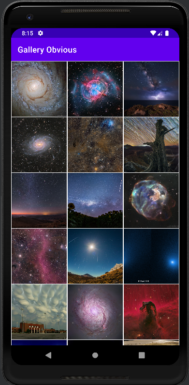
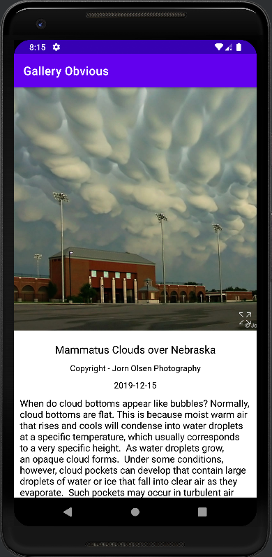
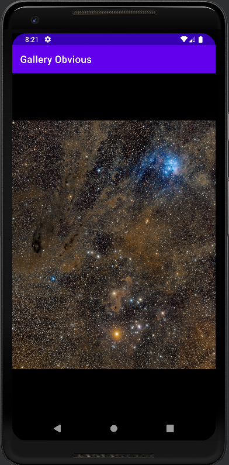

# Obvious Gallery App
Obvious Gallery is an gallery app that shows the latest and greatest images from NASA

Main page             |  Detail page          |  Full screen page
:-------------------------:|:-------------------------:|:-------------------------:|
  |    |  

## Getting Started
### Setup
Clone or download the repo 

### Open and Run Project in Android Studio
Open the project in Android Studio and click RUN. Simple.

### Libraries
1. Glide
2. Viewpager2
3. GSON
4. MockK

### Android Version Targeting
Works on Marshmallow and above

### Todos

 - UI Tests
 - Add Night Mode
 - Live internet check
 - Remove appbar when in full screen

### License

MIT